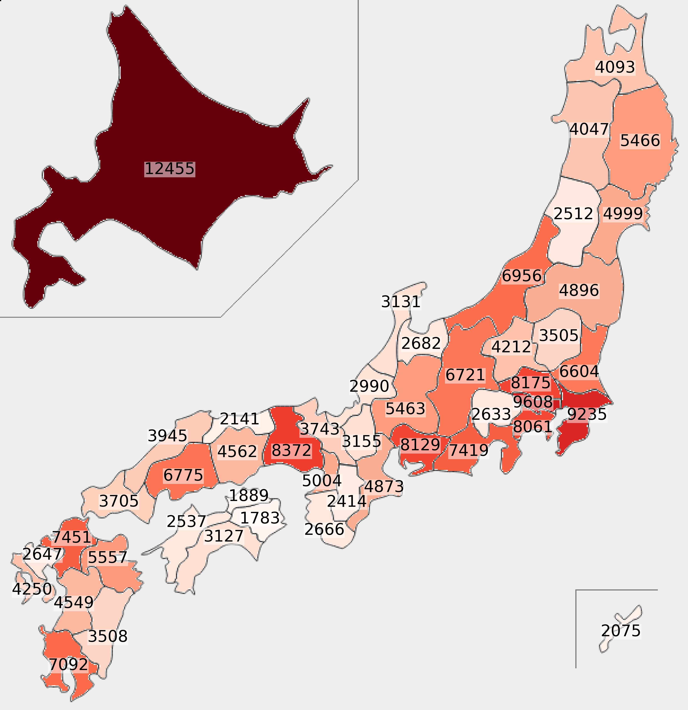
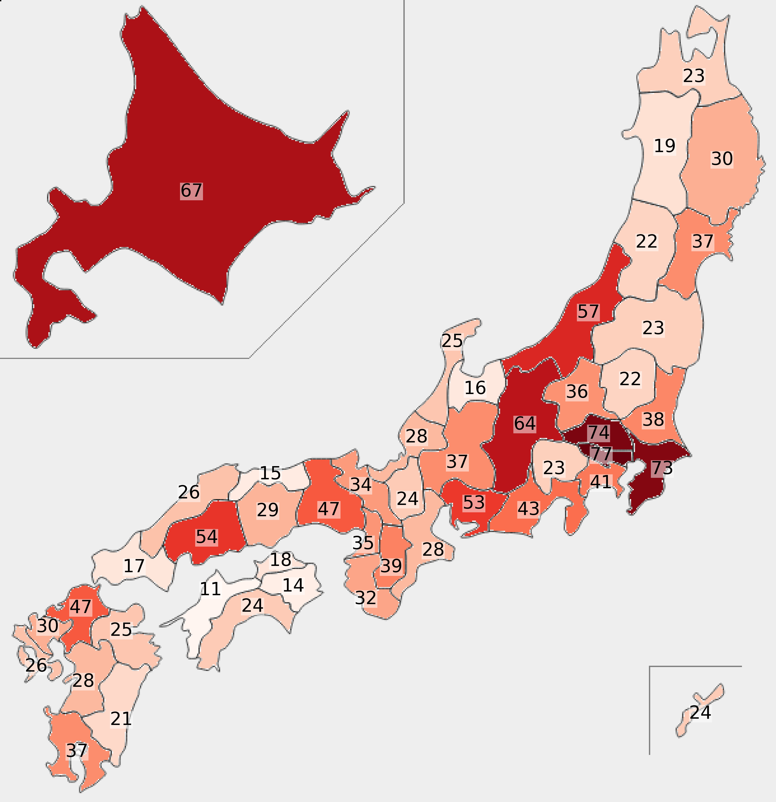
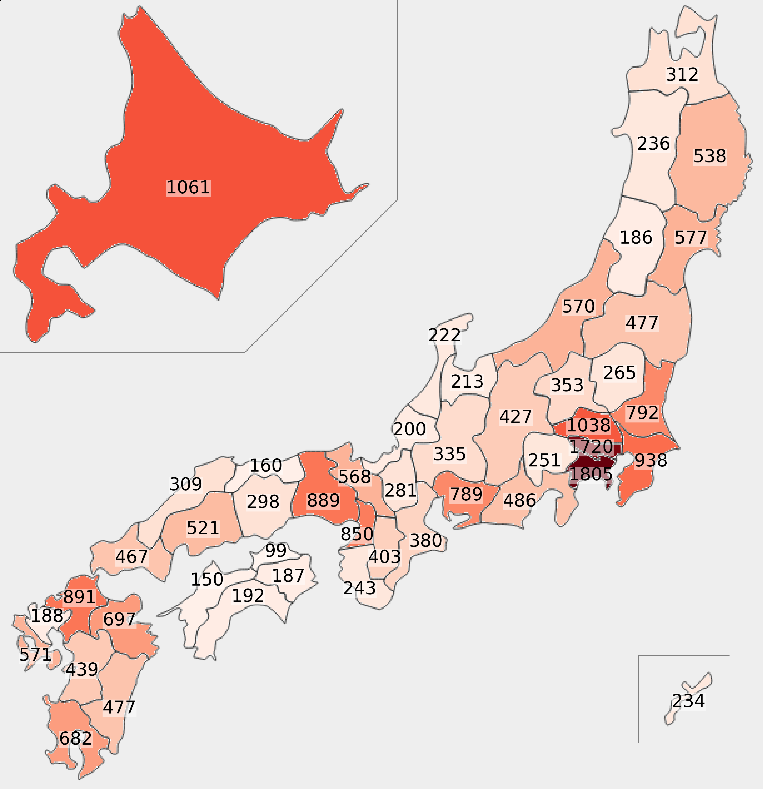

# Japanese Bus Stop Data
This data is an excerpt and statistical processing of the [Bus Stop Data](https://nlftp.mlit.go.jp/ksj/gml/datalist/KsjTmplt-P11-v3_0.html) provided by MLIT Japan.

このデータは，国土交通省が提供する[バス停留所データ](https://nlftp.mlit.go.jp/ksj/gml/datalist/KsjTmplt-P11-v3_0.html)を抜粋・統計処理したものです．

# How To Use
1. Download P11-22_SHP.zip from the [site](https://nlftp.mlit.go.jp/ksj/gml/datalist/KsjTmplt-P11-v3_0.html) and place it in this directory.
2. Execute the following command.
```bash:
python main.py P11-22_SHP.zip
```

# Example
|||
|:-:|:-:|
|||
|Number of bus stops|Number of merged bus stops|
|||
|Number of bus operators|Number of bus routes|

# License
* Original data: [PDL1.0](https://www.digital.go.jp/en/resources/open_data/public_data_license_v1.0)
* Processed data: [CC BY 4.0](https://creativecommons.org/licenses/by/4.0)

# Sources and Related Links
* [Ministry of Land, Infrastructure, Transport and Tourism](https://www.mlit.go.jp)
* [Japan Geospatial Times](https://jgtimes.org)
* [National Land Numerical Information Download Service](https://nlftp.mlit.go.jp)
* [Bus Stop Data](https://nlftp.mlit.go.jp/ksj/gml/datalist/KsjTmplt-P11-v3_0.html)
* [Bus Operator Data](https://bus-routes.net/bus.php)
